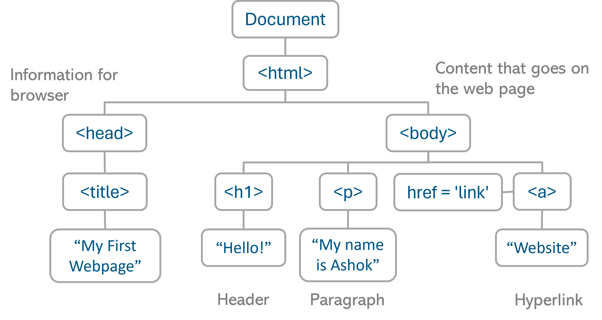

#### Date: 07/12/2024

Written by: Arijeet Konar

### 1. What is VS Code?
**Ans.** **Visual Studio Code (VS Code)** is a lightweight, free, open-source code editor developed by Microsoft. It's designed for a wide range of programming and development tasks and supports many programming languages like C,C++, Java, JavaScript, Python etc.

Download VS Code here:
[VS Code](https://code.visualstudio.com/)

### 2. What is an .html in index.html?
**Ans.** In **index.html**, the **.html** is the file extension that indicates the file is an HTML document.
    Other examples of file extension are -
    .txt - for writing text files,
    .css - for writing css files,
    .js - for writing javascript files

### 3. What are the different parts of a website?
**Ans.** A website is composed of -
    1. HTML
    2. CSS and
    3. JavaScript.
    In order to understand this let us take the analogy of the human body
        The skeleton of the website - HTML
        The skin, hair and other external attributes - CSS
        The brain and the central nervous system - JavaScript


**Tips** - Use the autosave option in VS Code

Extensions to use in VS Code -  1.Live Server  2.Prettier

### 4.What is meant by boilerplate code?
**Ans.** Boilerplate code refers to sections of code that are repeated in multiple places with little or no modification. It's typically required for setting up the foundational structure of an application, project, or specific functionality, but doesn't necessarily relate to the core logic of the program.

Example:
 ```html
<!DOCTYPE html>
<html lang="en">
<head>
    <meta charset="UTF-8">
    <meta name="viewport" content="width=device-width, initial-scale=1.0">
    <title>Document</title>
</head>
<body>

</body>
</html>
```
 ### 5. What are tags in html?
 **Ans.** In HTML, tags are the building blocks used to define and structure elements on a webpage. Tags are written using angle brackets (< >) and typically come in pairs: an opening tag (e.g., <tagname>) and a closing tag (e.g., </tagname>), though some tags are self-closing.

 Examples - `<p> <h1></h1>  <  <hr/>  <br/> </p>`

### 6. What is an HTMl element?
**Ans.** An <openingTag> + content + </closingTag> form an html element. It is the basic building block of an html document.

Example - `<p><h1>Content</h1></p>`

### HTML tag tree


### 7. Define meta, link and title tags in HTML.
**Ans.**
 1. `<p><meta></p>`: Defines metadata for the webpage (SEO, responsiveness, character set).
 2. `<p><link></p>`: Links external resources like CSS files and favicons.
 3. `<p><title></p>`: Sets the webpage title shown in browser tabs and improves SEO.

Example -

```html
<!DOCTYPE html>
<html lang="en">
<head>
    <meta charset="UTF-8">
    <meta name="viewport" content="width=device-width, initial-scale=1.0">
    <meta name="description" content="Learn about meta, link, and title tags in HTML.">
    <link rel="stylesheet" href="styles.css">
    <link rel="icon" href="favicon.ico" type="image/x-icon">
    <title>Understanding Meta, Link, and Title Tags</title>
</head>
<body>
    <h1>Welcome to My Website</h1>
</body>
</html>
```

### Heading Tags in HTML
HTML heading tags are used to define headings in a document. These tags range from **h1** to **h6**, with **h1** being the most important or prominent and **h6** being the least.

```html
<h1>This is a main heading</h1>
<h2>This is a subheading</h2>
<h3>This is a sub-subheading</h3>
<h4>This is a smaller heading</h4>
<h5>This is an even smaller heading</h5>
<h6>This is the smallest heading</h6>
```
### VSCode Shortcuts
[VS Code Shorcut Windows](https://code.visualstudio.com/shortcuts/keyboard-shortcuts-windows.pdf)
[VS Code Shorcut MacOs](https://code.visualstudio.com/shortcuts/keyboard-shortcuts-macos.pdf)

### Lorem

In the context of HTML and Visual Studio Code (VS Code), "lorem" refers to placeholder text commonly used in web development and design. It originates from "Lorem Ipsum," a scrambled version of Latin text used to fill spaces in design templates or mock-ups.

Usage in VS Code:
1.Open an HTML file in VS Code.
2.Type lorem and press Tab or Enter.
3.VS Code automatically generates a paragraph of Lorem Ipsum text.

Typing lorem5 generates 5 words
Typing lorem10 generates 10 words.

### `<b>` tag
The `<b>` tag in HTML is used to bolden text without implying any added importance or emphasis. It is typically used for styling purposes when you want to draw attention to text visually, but without conveying extra meaning.

```html
<b>Your Text Here</b>
```

### `<i>` tag
The `<i>` tag in HTML is used to display text in italic style. It is often used for stylistic purposes or to indicate a particular type of content, such as titles, foreign words, or technical terms, without adding any semantic meaning.

```html
<i>Your Text Here</i>
```
### `<br>` tag `<hr>` tag(auto closing  tag)
| Tag | Purpose | Visual Effect |
|------------------|------------------|------------------|
| `<br>`   | Adds a line break in the text   | Moves content to a new line   |
| `<hr>` | Adds a horizontal rule for separation   | Displays a horizontal line   |

They are self-closing tags (do not require a closing tag)

Example of `<br>`tag -
```html
Address: 123 Main St.<br>City, State, ZIP.
```
Example of `<hr>`tag -
```html
<h2>End of Chapter 1</h2>
<hr>
<h2>Start of Chapter 2</h2>
```

### `<sub>` `<sup>` tag
| Tag | Use Case | Example | Visual Effect |
|------------------|------------------|------------------|------------------|
| `<sub>` | Text below baseline (subscript)   | H`<sub>`2`</sub>`O   | H₂O
| `<sup>` | Text above baseline (superscript)   | x`<sup>`2`</sup>`   | x²

### `<ol>` `<ul>` `<li>` tag
| Tag    | Description                                          | Example Output                          |
|--------|------------------------------------------------------|-----------------------------------------|
| `<ol>` | Creates an ordered list with numbered items          | 1. Item 1 <br> 2. Item 2 <br> 3. Item 3 |
| `<ul>` | Creates an unordered list with bullet points         | • Item 1 <br> • Item 2 <br> • Item 3    |
| `<li>` | Defines a list item in either ordered or unordered lists | Item 1 <br> Item 2 <br> Item 3 |

Example of Ordered List -
```html
<ol>
    <li>First Item</li>
    <li>Second Item</li>
    <li>Third Item</li>
</ol>
```
- First Item
- Second Item
- Third Item

```html
<ul>
    <li>First Item</li>
    <li>Second Item</li>
    <li>Third Item</li>
</ul>
```
1. First Item
2. Second Item
3. Third Item

### anchor tag and target attribute
The `<a>` tag is used to create hyperlinks in HTML. It can link to other web pages, files, email addresses, or even a specific part of the same page.

**target** Attribute
The target attribute specifies where to open the linked document. Common values for the target attribute are:

- _blank: Opens the link in a new window or tab.
- _self: Opens the link in the same frame or window (this is the default).
- _parent: Opens the link in the parent frame.
- _top: Opens the link in the full body of the window.

**Syntax**
```html
<a href="URL" target="value">Link Text</a>
```
### `<input>` tag and `<label>` tag

The `<input>` tag is used to create various types of interactive controls in a form, such as text fields, checkboxes, radio buttons, and buttons.

Common Types of `<input>` Elements:
- type="text": Creates a single-line text input field.
- type="password": Creates a password input field where text is obscured.
- type="checkbox": Creates a checkbox.
- type="radio": Creates a radio button.
- type="submit": Creates a button that submits the form.

The `<label>` tag is used to define a label for an `<input>` element. It improves accessibility by allowing users to click the label to focus on the corresponding input field.

Usage with **for** Attribute:
The for attribute in the `<label>` tag associates the label with an input field. The value of the for attribute must match the id of the input element.

```html
<!DOCTYPE html>
<html lang="en">
<head>
    <meta charset="UTF-8">
    <meta name="viewport" content="width=device-width, initial-scale=1.0">
    <title>Input and Label Example</title>
</head>
<body>
    <form action="#">
        <p>
            <label for="username">Username:</label>
            <input type="text" id="username" name="username">
        </p>
        <p>
            <label for="password">Password:</label>
            <input type="password" id="password" name="password">
        </p>
        <p>
            <label for="remember">Remember me:</label>
            <input type="checkbox" id="remember" name="remember">
        </p>
        <p>
            <input type="submit" value="Login">
        </p>
    </form>
</body>
</html>
```
### `` tag
The `` tag is used to embed images in a webpage. It is an empty tag (self-closing), meaning it does not have a closing tag. It requires at least the src (source) attribute to define the image location, and optionally, the alt attribute to provide alternative text for accessibility and SEO.

Some attributes of the  Tag:
- src: Specifies the path to the image.
- alt: Provides alternative text for the image (useful for screen readers and SEO).

```html

```
### `<video>` tag
The `<video>` tag is used to embed video content in a webpage. It allows you to display video files directly in the browser without needing third-party plugins like Flash. HTML5 introduced this tag, making it easier to handle multimedia content.

Attributes of the <video> Tag:
- src: Specifies the path to the video file.
- autoplay: Automatically starts playing the video once it has loaded.
- loop: Makes the video play in a continuous loop.
- muted: Mutes the video by default.

```html
<video src="video_url" autoplay loop muted>
    Your video tag.
</video>
```

### `<audio>` tag
The `<audio>` tag is used to embed audio content (such as music or sound effects) in a webpage. Like the <video> tag, it allows users to play, pause, and control the volume of audio without requiring third-party plugins.

Attributes of the <audio> Tag:
- src: Specifies the path to the audio file.
- autoplay: Automatically starts playing the audio when the page loads.
- loop: Makes the audio play in a continuous loop.
- muted: Mutes the audio by default.

```html
<audio src="audio_url" autoplay loop muted>
    Your audio tag.
</audio>
```
### Semantic HTML tags
Semantic HTML tags provide meaning to the content of a webpage, making the structure more readable and accessible. These tags help search engines and other user agents understand the content better, improving SEO (Search Engine Optimization) and accessibility.

Some examples of semantic tags are -
`<article>` Represents a self-contained piece of content that can be distributed or reused independently (e.g., blog posts, news articles, forum posts).

`<aside>` Represents content that is tangentially related to the content around it, often used for sidebars, advertisements, or related links.

`<details>` Represents a disclosure widget from which the user can obtain additional information or controls, usually in the form of a collapsible section.

`<figcaption>` Represents a caption or legend for content inside a `<figure>` element, such as an image, chart, or illustration.

`<figure>` Represents content like images, illustrations, diagrams, or videos, along with optional captions (`<figcaption>`).

`<footer>` Represents the footer section of a webpage or section, typically containing copyright information, contact details, and links.

`<header>` Defines the header of a document or section. It typically contains introductory content such as logos, navigation links, and headings. A page can have multiple `<header>` elements, each associated with a section or the whole page.

`<main>`  Represents the main content of the document. It is used to group the dominant content of the page that is directly related to or expands upon the central theme of the page. The `<main>` element should be used only once per page, as it highlights the primary content and helps with SEO and accessibility.

`<mark>` Used to highlight or mark text for reference or emphasis, often representing a search result or important information.

`<nav>` Defines a navigation section that contains links to other pages or sections within the website. It helps search engines and screen readers understand the navigation structure of the site.

`<section>` Used to group related content in a document, typically representing a thematic block or subsection of a page. It is used for creating distinct sections such as articles, chapters, or topics.

`<summary>` Provides a summary or a clickable heading for the `<details>` element. When clicked, it expands or collapses the detailed content.

Some code examples below -
```html
<article>
    <h2>Article Title</h2>
    <p>This is the content of the article.</p>
</article>
```

```html
<aside>
    <h3>Related Articles</h3>
    <ul>
        <li><a href="#">Article 1</a></li>
        <li><a href="#">Article 2</a></li>
    </ul>
</aside>
```

```html
<footer>
    <p>&copy; 2024 My Website. All rights reserved.</p>
</footer>

```


**Thank You**


